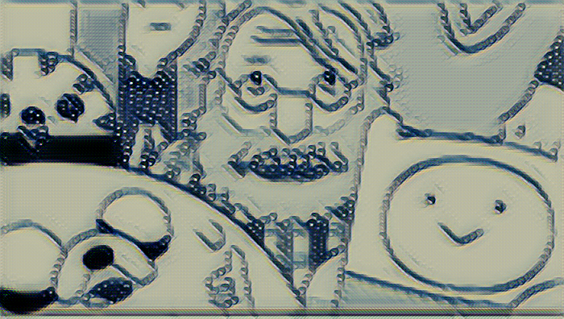
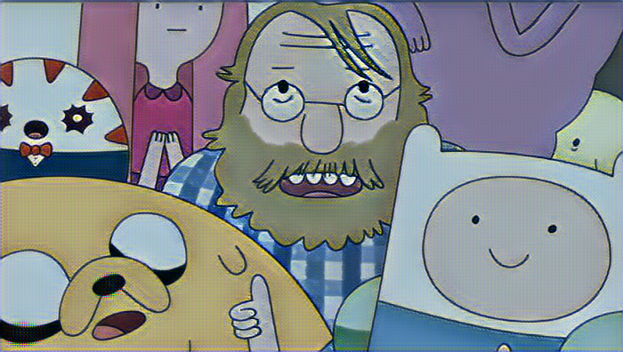

### TEAM 2


During the the Deep Learning for Computer Vison course at UPC at Summer 2017, we have completed some tasks:

### TASK 1
The aim of task 1 is to create a neural network and explore its behaviour when changing parameters such as: number of layers, batch size, epochs...
In order to do that the task is composed by subtasks:
1.1 - Architecture
1.2 - Training
1.3 - Visualization

### TASK 2
Once we have selected the best configuration for our network, in task 2 we will validate it using Terrassa Buildings dataset. By doing it, we will be able to see how our network interacts with a completely different dataset.
In task 2, we have to also evaluate a model trained by ImageNet with the Terrassa Buildings dataset.

### TASK 3
Task 3 consists on fine-tunning a model trained using ImageNet, with the Terrassa Buildings dataset and validate the results with this same dataset.

### TASK 4
During task 4 we have to improve the performance of the previous network, exploring different possibilities for obtaining better results.

### TASK 5
Task 5 is an open project, we have chosen a style transfer network. The code used can be found in https://github.com/lengstrom/fast-style-transfer and it is written in TensorFlow.
The most important part in style transfer networks is the loss function. We can find three different terms in the loss function implemented, a content loss, a style loss and a total variation loss. The first term, the content loss, is telling us how close our generated image is from the original one, so it will be the responsible of preserving the information found in the original image. The style loss is the one responsible of transferring the style of the chosen image to our inputs. Finally the last term of the loss is a denoising term, it is removing the noise of our generated image. Each of these terms will have a weight associated, so if we increment the weight of the content loss term we will be saying that in the generated images is more important the content of the image than the style. The opposite occurs when the weight associated to the style loss is higher. For that reason, we can play with those weights in order to see how the outputs of the network change. Here we can see an example, with a content loss weight equal to 15 we can see better the style of the image than in the case of a weiht of 100.



Another important aspect in every network is how much time we let the network learn, here we can see an evolution of the output image depending on the epoch, with a content loss weight equal to 15. As can be seen, as we increase the number of epochs the information of the image is more clear. In that case we have chosen a mandala as the style image.


### Markdown

Markdown is a lightweight and easy-to-use syntax for styling your writing. It includes conventions for

```markdown
Syntax highlighted code block

# Header 1
## Header 2
### Header 3

- Bulleted
- List

1. Numbered
2. List

**Bold** and _Italic_ and `Code` text

[Link](url) and 
```

For more details see [GitHub Flavored Markdown](https://guides.github.com/features/mastering-markdown/).


