During the the Deep Learning for Computer Vison course at UPC at Summer 2017, we have completed some tasks:

## TASK 1
The aim of task 1 is to create a neural network and explore its behaviour when changing parameters such as: number of layers, batch size, epochs... 

In order to do that the task is composed by subtasks: 
### ARCHITECTURE 
#### 2-FC NETWORK

| Architecture |
| ------ |
|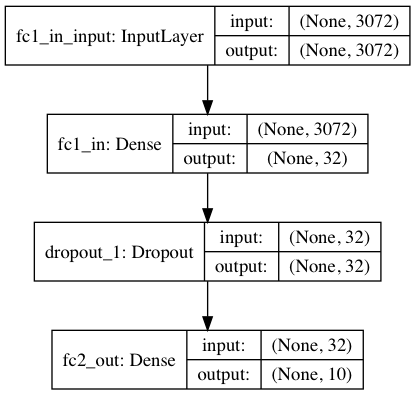|

#### 4-Conv2D+3FC NETWORK

| Architecture |
| ------ |
|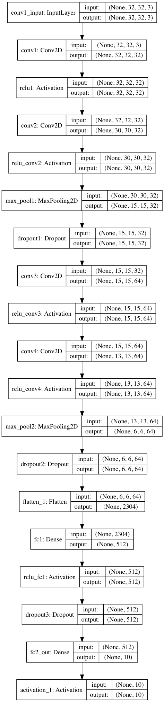|

### 1.2 TRAINING

#### 2-FC NETWORK TRAINING

| 100 Epochs | 200 Epochs |
| ------ | ------ |
| 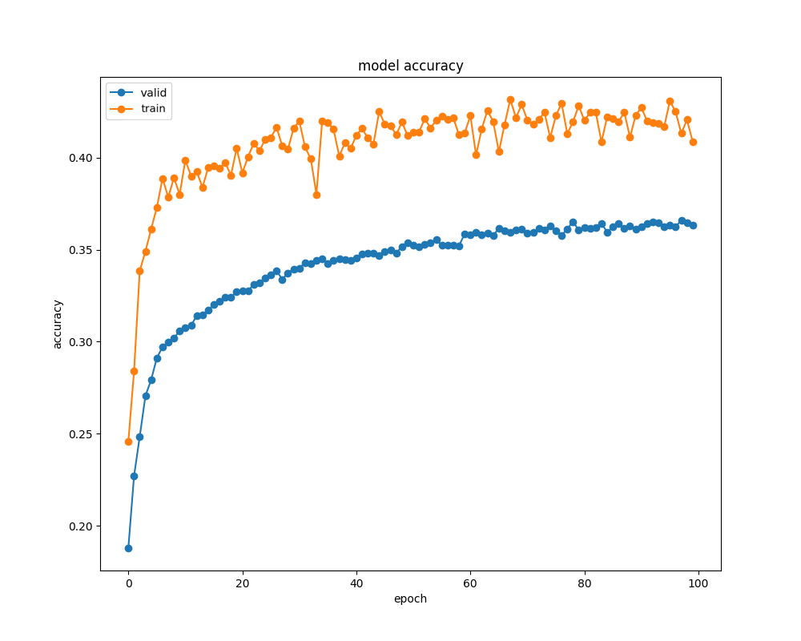 | 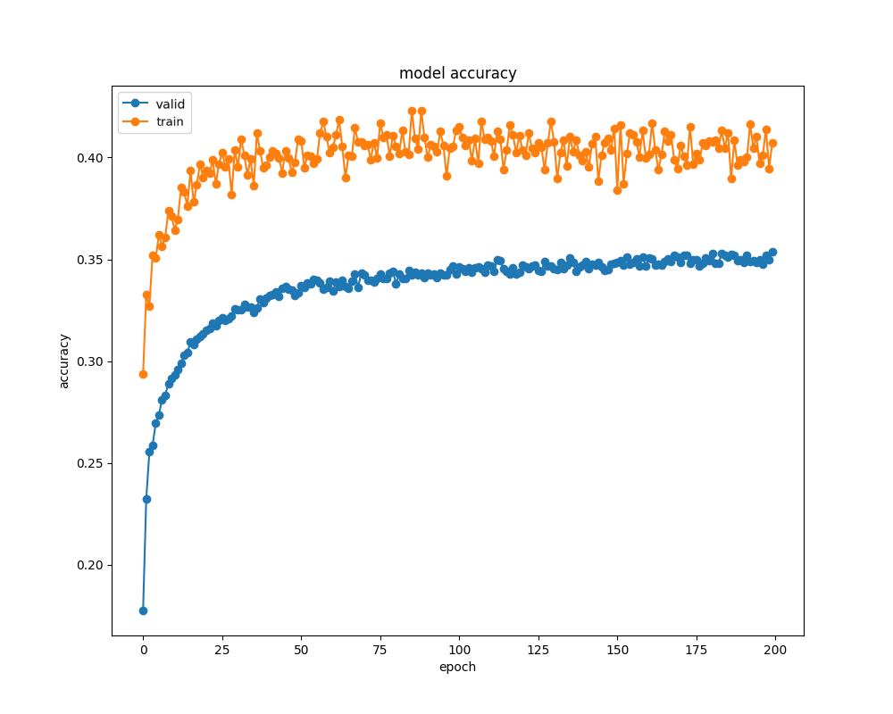 |
| Validation Accuracy: 36 %  | Validation Accuracy: 35% |

#### 4-Conv2D+3FC NETWORK TRAINING

| Without Data Augmentation | With Data Augmentation|
| ------ | ------ |
| 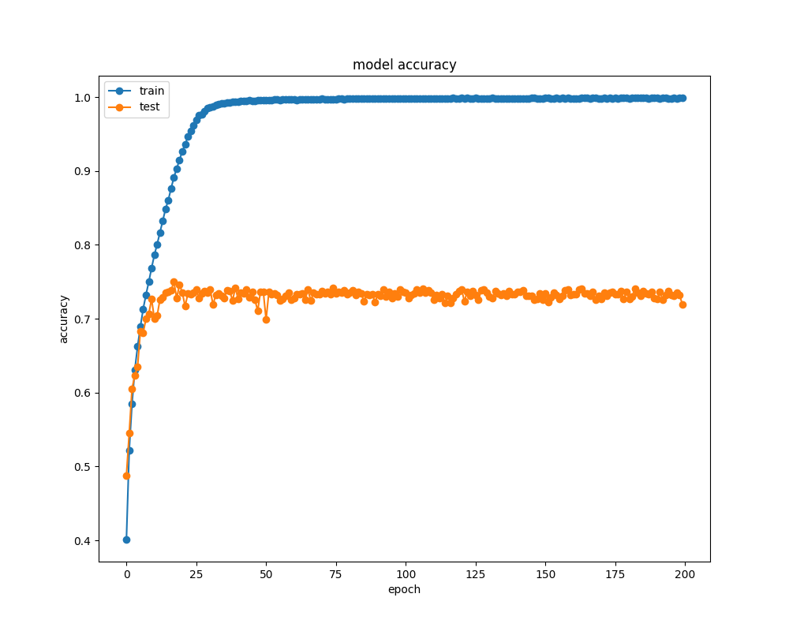 | 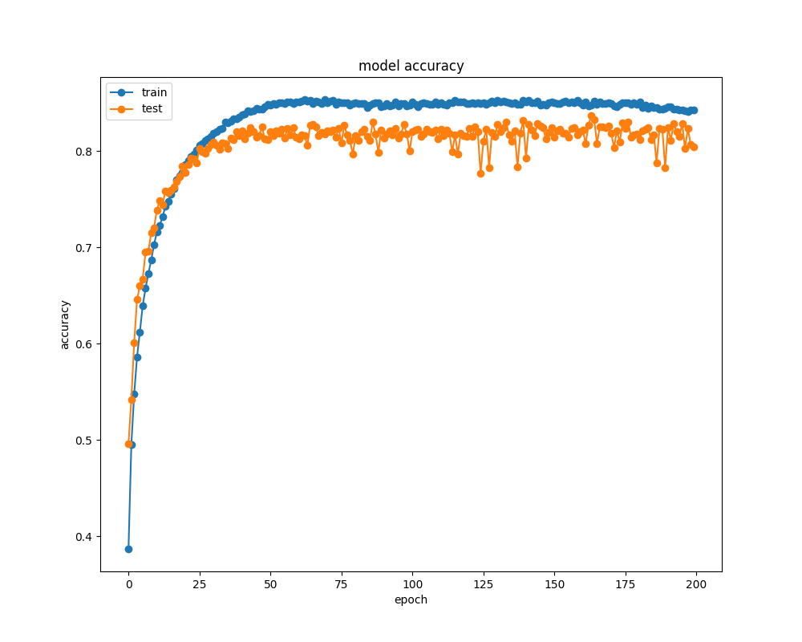 |
| Validation Accuracy: 73 %  | Validation Accuracy: 81 % |

| With Dropout|
| ------ |
||

| With Batch Normalization|
| ------ |
||

### 1.3 VISUALIZATION

The visualizations were carried out by means of a high-level toolkit for visualization and debug of trained keras neural networks provided by [Keras-vis](https://raghakot.github.io/keras-vis/).

#### FILTER RESPONSES

Each conv layer has several learned 'template matching' filters that maximize their output when a similar template pattern is found in the input image. This makes the first conv net layer highly interpretable by simply visualizing their weights as it is operating over raw pixels. One way of interpreting them is to generate an input image that maximizes the filter output.
So, by means of the keras-vis toolkit is easy to generate the following stitched image representing input image(s) that maximize the filter index output (number over the image). They mostly seem to match for specific color and directional patterns.

Image on the left corresponds to the own trained model on [CIFAR-10 dataset](https://www.cs.toronto.edu/~kriz/cifar.html) and the following one belongs to a [VGG-16](https://gist.github.com/baraldilorenzo/07d7802847aaad0a35d3) pre-trained model on [Imagenet dataset](http://www.image-net.org).

| 4-Conv2D+3FC | VGG16 (Imagenet)|
| ------ | ------ |
|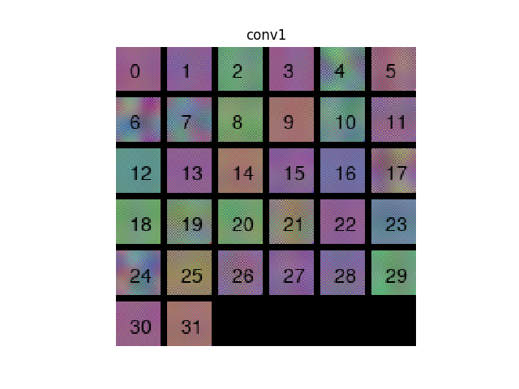| 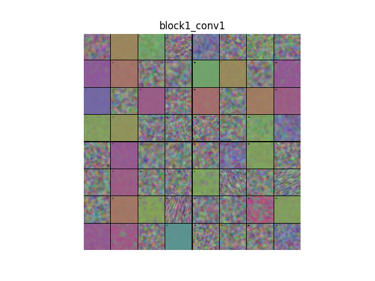|

#### ACTIVATION MAPS
Attention maps are a family of methods that try to answer these questions by generating a heatmap over input image that most contributed towards maximizing the probability of an output class.

One more time, by means of [Keras-vis](https://raghakot.github.io/keras-vis/) is possible to generate the following heatmaps adopting the [grad-CAM method](https://arxiv.org/pdf/1610.02391v1.pdf).

| 4-Conv2D+3FC | VGG16 (Imagenet)|
| ------ | ------ |
|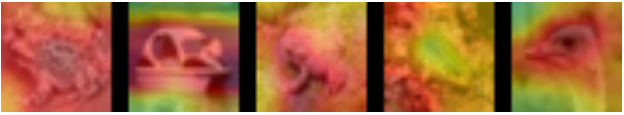| 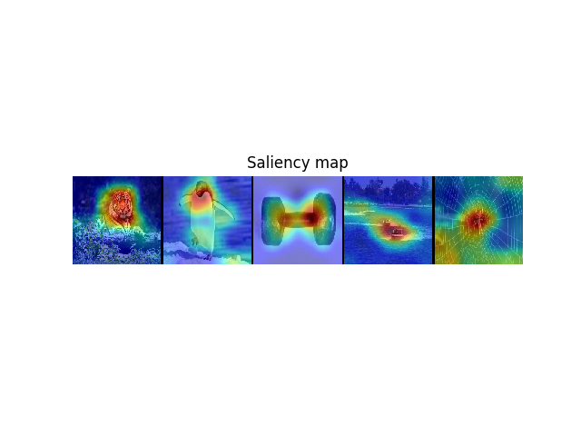|

## TASK 2
Once we have selected the best configuration for our network, in task 2 we will validate it using Terrassa Buildings dataset. By doing it, we will be able to see how our network interacts with a completely different dataset. In order to do this, we must preserve all the network with the exception of the last layer, which has to be replaced for another softmax classifier but with 13 classes instead of 10 like in the case of cifar10. Then, we trained it and obtained the following results:

In task 2, we have to also evaluate a model trained by ImageNet with the Terrassa Buildings dataset. For this purpose, we are going to explore how we can train a softmax classifier on top of the ResNet-50 trained on Imagenet. For that we are going to load first the ResNet-50. Then, we will also have to load the database. The database parsing is done on another function and the outputs are saved on "imageTrain.npy" and "labels.npy". We will also divide the database into train and test, using sklearn.
This leads to the following results:

Epoch 20/20
597/597 [==============================] - 14s - loss: 0.0418 - acc: 1.0000 - val_loss: 0.3464 - val_acc: 0.8983

## TASK 3
Task 3 consists on fine-tunning a model trained using ImageNet, with the Terrassa Buildings dataset and validate the results with this same dataset. For this, we are going to Fine-Tune the same network of 2.2 with the Terrassa database.
We first create the model we are going to use. In this case, we are going to train 101 layers inside the network (we will also work with a lower learning rate because we don't want to shift the pre-trained weights too much).
Finally, we obtain the following results:

Epoch 25/25
597/597 [==============================] - 11s - loss: 1.7471e-04 - acc: 1.0000 - val_loss: 0.2900 - val_acc: 0.9322

## TASK 4
During task 4 we have to improve the performance of the previous network, exploring different possibilities for obtaining better results. For this, we are going to Fine-Tune the same network of 2.2 with the Terrassa database.
In this case, we are going to train 101 layers inside the network. We have also created a LRReducer so that we can modify the learning rate when the validation accuracy stops improving (we will also work with a lower learning rate because we don't want to shift the pre-trained weights too much). Also, we will create a data augmentation framework for the Training and Validation datasets.
Finally, we obtain the following results:

Epoch 25/25
18/18 [==============================] - 16s - loss: 0.0186 - acc: 0.9983 - val_loss: 0.2651 - val_acc: 0.9278

## TASK 5
Task 5 is an open project, we have chosen a style transfer network.  

The code used can be found in https://github.com/lengstrom/fast-style-transfer and it is written in TensorFlow. 

The most important part in style transfer networks is the loss function. We can find three different terms in the loss function implemented, a content loss, a style loss and a total variation loss. The first term, the content loss, is telling us how close our generated image is from the original one, so it will be the responsible of preserving the information found in the original image. The style loss is the one responsible of transferring the style of the chosen image to our inputs. Finally the last term of the loss is a denoising term, it is removing the noise of our generated image. Each of these terms will have a weight associated, so if we increment the weight of the content loss term we will be saying that in the generated images is more important the content of the image than the style. The opposite occurs when the weight associated to the style loss is higher. For that reason, we can play with those weights in order to see how the outputs of the network change. Here we can see an example with different weights for the different terms of the loss function, with a content loss weight equal to 15 we can see better the style of the image than in the case of a weiht of 100. 

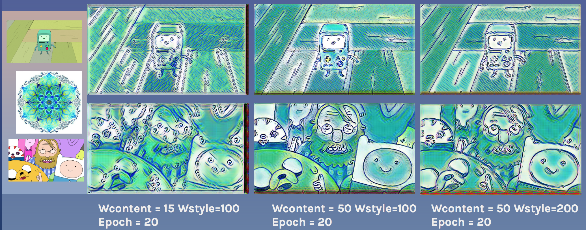
Another important aspect in every network is how much time we let the network learn, here we can see an evolution of the output image depending on the epoch, with a content loss weight equal to 15. As can be seen, as we increase the number of epochs the information of the image is more clear. In that case we have chosen a mandala as the style image. 

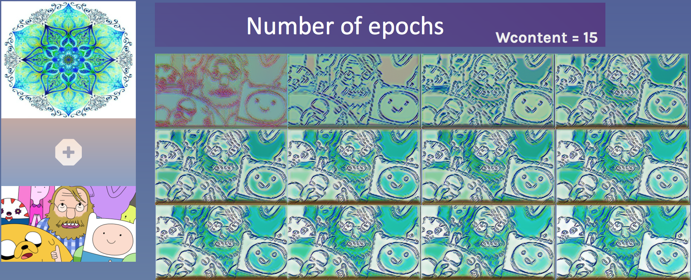

Testing the network with other images (Weight content loss = 15): 

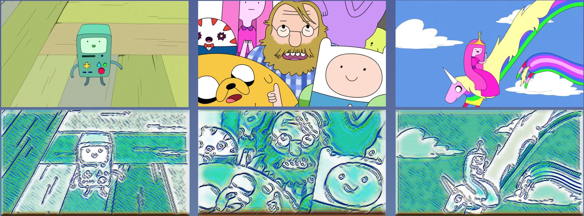

If we increase the weight of the content loss (Weight content loss = 50) the results of the same network will be the following: 

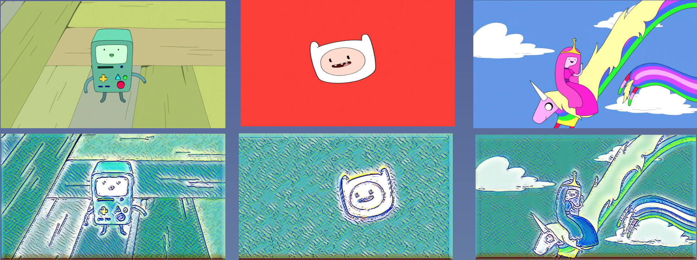

We have trainned the network with different styles:  

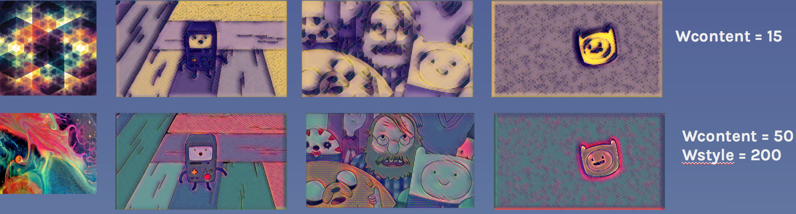

